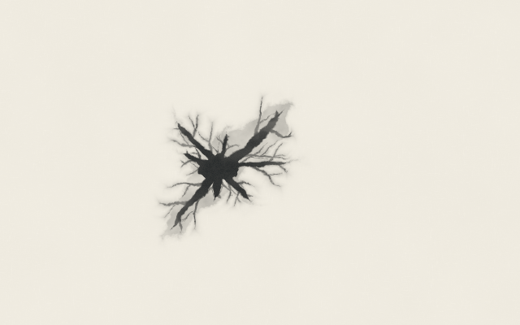
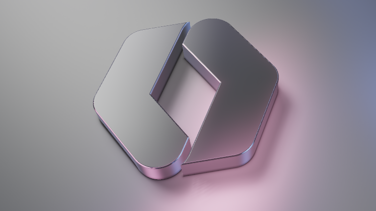
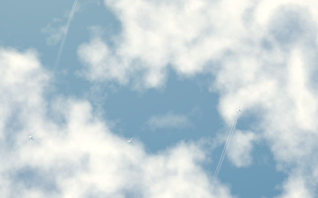
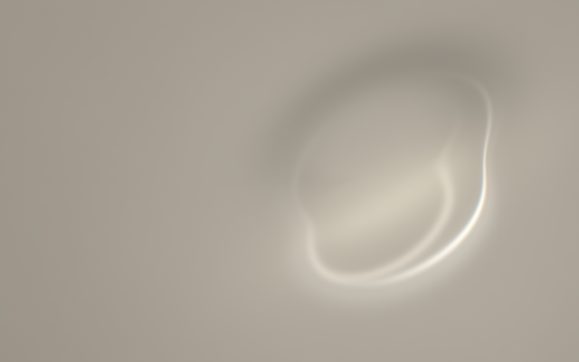
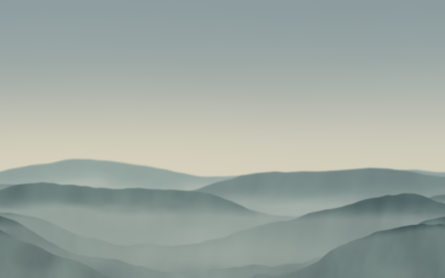

# Shader Paper

Living wallpapers, drawn in Metal.

Shader Paper moves while your Mac is locked or showing its screen saver, gently settles when you return, and holds its place while you work. Each wallpaper remembers its place and continues from there next time. Flight's sky and Portal's studio lighting also follow your Mac's local time. Flight shifts through dawn, daylight, sunset, and moonlit clouds; Portal shows neutral silver by day and a darker studio at night, with colored edge accents throughout.



## The collection

Eight included wallpapers: **Fable 5**, **GPT6-Astra**, **GPT6-Astra-II**, **Ink**, **Light**, **Weather**, **Portal**, and **Flight**.

| Portal | Flight |
| --- | --- |
|  |  |
| The [WorkOS](https://workos.com/) mark sculpted in magnesium: fine bead-blasted faces, precise chamfers, brushed cut walls, directional daylight with silver and blue edge highlights, a dark evening studio, restrained pink, violet, and blue reflections, and a gentle turn accompanied by a drifting camera. | Tiny airliners crossing sunlit cloud banks, leaving fine trails that slowly dissolve. |

| Ink | Light | Weather |
| --- | --- | --- |
|  |  |  |
| Graphite finding paths through paper. | A quiet caustic cast by unseen glass. | Mist passing through a small landscape. |

The artwork renders directly from its saved time. There is no recorded loop in the native wallpaper app. Once motion settles, its animation timer stops. Flight and Portal refresh their lighting about once a minute while their motion stays still; other wallpapers retain the exact settled frame. Lighting follows an artistic daily schedule, without location access or a sunrise calculation. Portal eases into daylight from 06:30 to 09:00 and back to night from 17:00 to 20:30, using your Mac’s local time. Sleep and inactive surfaces stop these lighting updates too.

## Build and run

Requires an Apple Silicon Mac running macOS 26 or later, Xcode or Command Line Tools with the macOS SDK, and a Metal device. No package dependencies are needed.

```sh
bash scripts/build.sh
mkdir -p "$HOME/Applications"
rsync -a --delete "build/native/Shader Paper.app/" "$HOME/Applications/Shader Paper.app/"
open "$HOME/Applications/Shader Paper.app"
```

Choose a wallpaper and click **Use as Wallpaper**. You can then close the gallery. The collection also appears under **Shader Paper** in **System Settings → Wallpaper**. Selection links the wallpaper and screen saver across all Spaces and displays.

**Restore Previous Wallpaper** restores the selection saved before activation. Existing Visual Meditation users should follow the [migration notes](docs/migration.md) to avoid registering two copies of the same extension.

This app uses private macOS wallpaper interfaces and is experimental: macOS updates may require adapting the extension. Builds default to local ad-hoc signing. You can supply a Developer ID Application identity through `CODE_SIGN_IDENTITY`; notarization is a separate step described in the [transfer instructions](docs/transfer.md#developer-id-signing-and-notarization).

## Transfer to another Mac

```sh
bash scripts/package.sh
```

This builds and verifies the app, then writes a versioned ZIP and SHA-256 checksum under `build/distribution/`. Transfer the ZIP to an Apple Silicon Mac running macOS 26 or later, unpack it, and follow the included [transfer instructions](docs/transfer.md). The archive includes the app, its wallpaper extension, and `SIGNING.txt` identifying the actual signer and stapled notarization ticket result; the destination does not need Xcode to try this build. Managed Macs may restrict the app regardless of signing or notarization.

Packaging does not install, register, or select a wallpaper. Source-build instructions and existing-installation guidance are included in the archive.

## Export a video or still

Render a clean recording directly from any included shader. Export uses a fixed timeline, so it does not depend on screen-recording performance or the wallpaper's current state.

```sh
bash tools/export/build.sh
build/export/render-shader movie \
  --shader Resources/shaders/Ink.shader --out build/Ink.mp4 \
  --width 1920 --height 1080 --time 0 --duration 30 --fps 30
build/export/render-shader still \
  --shader Resources/shaders/Light.shader --out build/Light.png \
  --width 3840 --height 2160 --time 18
```

Movies are silent H.264 MP4 files. See [export and validation](tools/export/README.md) for options. The older recorded-aerial experiment and its temporal HEVC encoder are retained under [tools/aerial](tools/aerial/README.md).

## Development

```sh
bash scripts/test.sh
```

Builds compile and render every selected shader at two times and aspect ratios. Tests check clock easing, exact pause and resume, retained display frames with no active rendering timer, and wallpaper selection/restore behavior using fixtures.

| Location | Purpose |
| --- | --- |
| `Sources/App` | Wallpaper gallery and selection |
| `Sources/Extension` | Native wallpaper extension and system lifecycle |
| `Sources/Shared` | Metal renderer, shader library, and saved clock |
| `Resources/shaders` | Self-contained artwork |
| `Resources/Shaders.txt` | Included collection |
| `Tests` | Rendering, motion, and selection checks |
| `tools` | Offline export and recorded-aerial tools |

Live rendering uses 30 fps, or 15 in Low Power Mode, and caps the long edge at 2560 pixels. Lock/unlock changes motion over two seconds. Sleep and Reduce Motion pause immediately. The renderer converts half-float artwork to SDR for display. Exports can use higher resolutions.

Shader entry points are `vertex_main` and `fragment_main`, with a `Float` animation time at fragment buffer 0 and an optional `Float` local hour at fragment buffer 1. Build thumbnails and exports default to noon; use `--hour` when exporting different lighting. See [architecture](docs/architecture.md) and the [artwork review](docs/studies/README.md).

Shader Paper grew out of [A Visual Meditation on Thinking](https://github.com/kanalo-shrek/a-visual-meditation). That project retains the original model experiment. Source history and third-party attributions are documented in [NOTICE.md](NOTICE.md).
